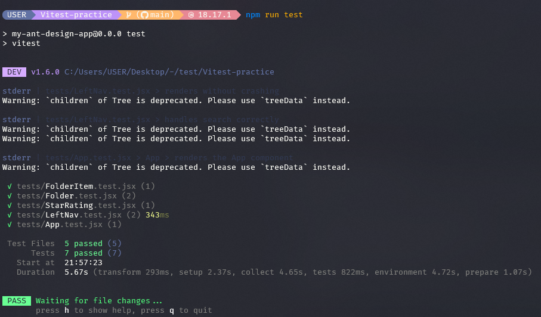

# Unit Testing w/ Vitest

This project is part of a course assignment that aims to test the functionality of a chosen project using unit tests. The project can be either a personal project or an open-source project.

## Getting Started

These instructions will get you a copy of the project up and running on your local machine for development and testing purposes.
1. clone the repository:
    ```bash
    git clone https://github.com/mrdaliselmi/Vitest-practice.git
    ```
2. Install Dependencies:
    ```bash
    cd Vitest-practice
    npm install
    ```
3. Run Tests:
    ```bash
    npm run test
    ```

## Unit Tests



## Test Coverage

run `npm run test:coverage` to generate a test coverage report.

